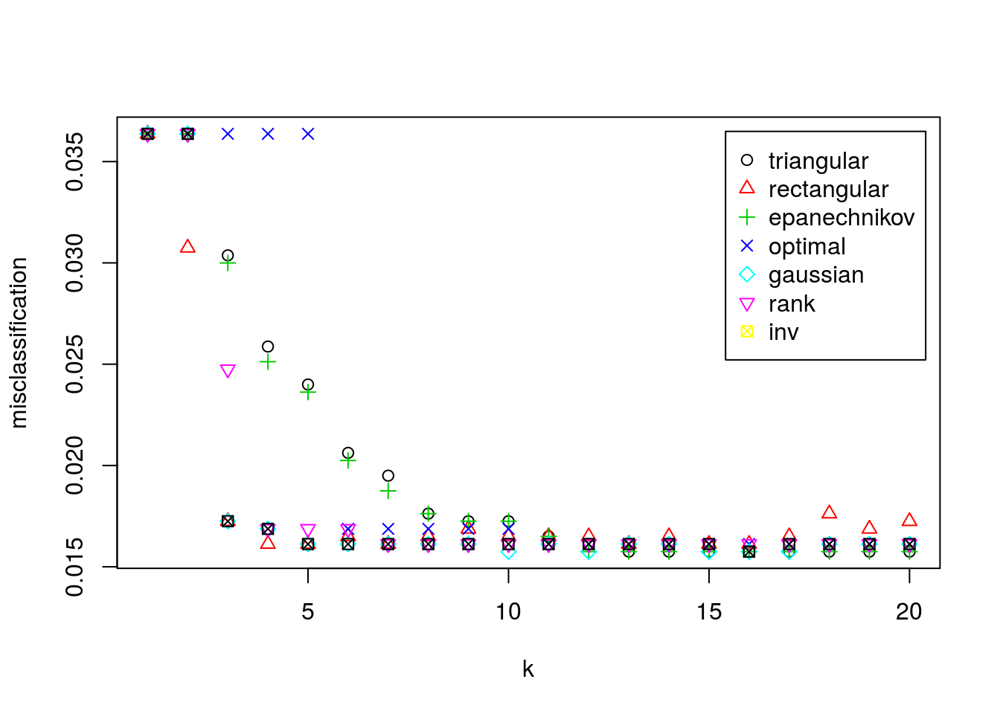

# Problema de clasificación

## Pasos previos

Para empezar, importamos nuestro archivo de datos `datawork.csv`.


```
## Parsed with column specification:
## cols(
##   .default = col_double(),
##   clasobj = col_character(),
##   x30 = col_integer()
## )
```

```
## See spec(...) for full column specifications.
```

Veamos una breve descripción del conjunto de datos.


```r
head(df)
```

```
## # A tibble: 6 × 42
##   clasobj varobj   x01   x02   x03   x04    x05   x06    x07    x08   x09
##     <chr>  <dbl> <dbl> <dbl> <dbl> <dbl>  <dbl> <dbl>  <dbl>  <dbl> <dbl>
## 1      CC  12.63  0.64  0.68 25.06 33.42 103.18  1.08  80.27  14.83 18.09
## 2      AA  25.08  0.70  0.72 16.08 10.98  38.31  1.62  57.32  30.72 17.13
## 3      DD  28.84  0.45  0.71 57.78 48.77 148.21  0.34 174.54  50.72  2.72
## 4      AA  26.58  0.15  0.56 17.79 10.04  30.33  0.86  57.44 167.47 23.09
## 5      BB  18.53  0.70  0.54 17.48 25.51  82.42  1.04  57.55  40.13  1.70
## 6      CC  14.20  0.37  0.75 50.01 32.25  99.49  0.92 153.46   1.90  1.76
## # ... with 31 more variables: x10 <dbl>, x11 <dbl>, x12 <dbl>, x13 <dbl>,
## #   x14 <dbl>, x15 <dbl>, x16 <dbl>, x17 <dbl>, x18 <dbl>, x19 <dbl>,
## #   x20 <dbl>, x21 <dbl>, x22 <dbl>, x23 <dbl>, x24 <dbl>, x25 <dbl>,
## #   x26 <dbl>, x27 <dbl>, x28 <dbl>, x29 <dbl>, x30 <int>, x31 <dbl>,
## #   x32 <dbl>, x33 <dbl>, x34 <dbl>, x35 <dbl>, x36 <dbl>, x37 <dbl>,
## #   x38 <dbl>, x39 <dbl>, x40 <dbl>
```


```r
summary(df)
```

```
##    clasobj              varobj            x01              x02        
##  Length:4000        Min.   : 10.49   Min.   :0.0700   Min.   :0.1300  
##  Class :character   1st Qu.: 14.35   1st Qu.:0.4000   1st Qu.:0.5100  
##  Mode  :character   Median : 19.34   Median :0.5000   Median :0.6000  
##                     Mean   : 20.86   Mean   :0.4989   Mean   :0.5977  
##                     3rd Qu.: 25.48   3rd Qu.:0.6000   3rd Qu.:0.7000  
##                     Max.   :713.81   Max.   :0.9400   Max.   :0.9300  
##       x03              x04             x05              x06       
##  Min.   :  0.94   Min.   :-0.64   Min.   :  2.96   Min.   :0.080  
##  1st Qu.: 15.55   1st Qu.:21.56   1st Qu.: 69.82   1st Qu.:0.660  
##  Median : 25.98   Median :29.54   Median : 94.06   Median :0.940  
##  Mean   : 30.42   Mean   :29.48   Mean   : 93.91   Mean   :1.015  
##  3rd Qu.: 40.17   3rd Qu.:37.34   3rd Qu.:117.63   3rd Qu.:1.270  
##  Max.   :166.17   Max.   :62.67   Max.   :194.56   Max.   :3.260  
##       x07              x08                x09                x10         
##  Min.   :  3.61   Min.   :    0.02   Min.   :   0.000   Min.   : 0.0000  
##  1st Qu.: 51.86   1st Qu.:    5.58   1st Qu.:   1.147   1st Qu.: 0.1000  
##  Median : 83.12   Median :   21.86   Median :   2.020   Median : 0.2500  
##  Mean   : 96.34   Mean   :  162.95   Mean   :   4.502   Mean   : 0.4398  
##  3rd Qu.:125.90   3rd Qu.:   80.82   3rd Qu.:   3.480   3rd Qu.: 0.5700  
##  Max.   :502.70   Max.   :68676.15   Max.   :1097.640   Max.   :24.1800  
##       x11               x12             x13             x14       
##  Min.   :  0.490   Min.   :10.57   Min.   : 9.26   Min.   :10.21  
##  1st Qu.:  2.158   1st Qu.:15.45   1st Qu.:15.45   1st Qu.:15.40  
##  Median :  2.960   Median :17.66   Median :17.60   Median :17.65  
##  Mean   :  4.197   Mean   :17.56   Mean   :17.58   Mean   :17.57  
##  3rd Qu.:  4.152   3rd Qu.:19.70   3rd Qu.:19.70   3rd Qu.:19.69  
##  Max.   :688.530   Max.   :25.16   Max.   :24.86   Max.   :24.64  
##       x15             x16             x17             x18       
##  Min.   :10.15   Min.   : 9.65   Min.   :10.13   Min.   :10.47  
##  1st Qu.:15.42   1st Qu.:15.37   1st Qu.:15.46   1st Qu.:15.43  
##  Median :17.58   Median :17.55   Median :17.60   Median :17.62  
##  Mean   :17.55   Mean   :17.55   Mean   :17.57   Mean   :17.57  
##  3rd Qu.:19.68   3rd Qu.:19.66   3rd Qu.:19.67   3rd Qu.:19.67  
##  Max.   :24.73   Max.   :25.50   Max.   :25.15   Max.   :25.22  
##       x19             x20             x21             x22       
##  Min.   :10.06   Min.   :10.26   Min.   : 9.59   Min.   : 9.44  
##  1st Qu.:15.44   1st Qu.:15.37   1st Qu.:15.45   1st Qu.:15.39  
##  Median :17.61   Median :17.66   Median :17.58   Median :17.63  
##  Mean   :17.58   Mean   :17.58   Mean   :17.54   Mean   :17.57  
##  3rd Qu.:19.72   3rd Qu.:19.67   3rd Qu.:19.63   3rd Qu.:19.71  
##  Max.   :25.08   Max.   :24.95   Max.   :25.09   Max.   :24.99  
##       x23             x24             x25             x26       
##  Min.   : 9.99   Min.   : 9.63   Min.   : 9.03   Min.   : 9.89  
##  1st Qu.:15.47   1st Qu.:15.41   1st Qu.:15.44   1st Qu.:15.39  
##  Median :17.59   Median :17.50   Median :17.64   Median :17.59  
##  Mean   :17.57   Mean   :17.55   Mean   :17.55   Mean   :17.59  
##  3rd Qu.:19.66   3rd Qu.:19.70   3rd Qu.:19.75   3rd Qu.:19.73  
##  Max.   :25.29   Max.   :25.15   Max.   :24.95   Max.   :25.05  
##       x27             x28             x29             x30       
##  Min.   : 5.91   Min.   : 7.81   Min.   :0.020   Min.   :10.00  
##  1st Qu.:15.23   1st Qu.:15.92   1st Qu.:0.250   1st Qu.:14.00  
##  Median :17.74   Median :18.41   Median :0.360   Median :16.00  
##  Mean   :17.78   Mean   :18.47   Mean   :0.375   Mean   :16.76  
##  3rd Qu.:20.36   3rd Qu.:21.14   3rd Qu.:0.490   3rd Qu.:19.00  
##  Max.   :47.94   Max.   :28.27   Max.   :0.920   Max.   :29.00  
##       x31              x32              x33             x34        
##  Min.   : 75.25   Min.   : 79.55   Min.   : 81.6   Min.   : 83.37  
##  1st Qu.:119.00   1st Qu.:118.01   1st Qu.:118.2   1st Qu.:132.24  
##  Median :135.91   Median :134.82   Median :135.5   Median :151.30  
##  Mean   :135.30   Mean   :133.66   Mean   :134.2   Mean   :150.74  
##  3rd Qu.:151.52   3rd Qu.:149.53   3rd Qu.:150.0   3rd Qu.:169.27  
##  Max.   :191.41   Max.   :185.77   Max.   :189.7   Max.   :241.19  
##       x35             x36              x37              x38       
##  Min.   : 75.3   Min.   : 35.80   Min.   :-26.19   Min.   :203.3  
##  1st Qu.:119.4   1st Qu.: 63.55   1st Qu.: 10.10   1st Qu.:326.0  
##  Median :136.8   Median : 73.68   Median : 19.36   Median :374.3  
##  Mean   :136.5   Mean   : 73.64   Mean   : 19.57   Mean   :372.6  
##  3rd Qu.:154.4   3rd Qu.: 83.84   3rd Qu.: 28.77   3rd Qu.:418.2  
##  Max.   :197.3   Max.   :110.56   Max.   :206.12   Max.   :534.5  
##       x39             x40       
##  Min.   :210.2   Min.   :226.3  
##  1st Qu.:312.5   1st Qu.:349.1  
##  Median :357.7   Median :398.4  
##  Mean   :355.8   Mean   :397.5  
##  3rd Qu.:397.9   3rd Qu.:446.0  
##  Max.   :493.2   Max.   :553.8
```

Observamos que la primera columna la interpreta como un string. Transformemos esta columna a factores.


```r
df$clasobj <- as.factor(df$clasobj)
```

Comprobamos que ha leido bien los datos.


```r
summary(df)
```

```
##  clasobj       varobj            x01              x02        
##  AA: 626   Min.   : 10.49   Min.   :0.0700   Min.   :0.1300  
##  BB:1315   1st Qu.: 14.35   1st Qu.:0.4000   1st Qu.:0.5100  
##  CC:1372   Median : 19.34   Median :0.5000   Median :0.6000  
##  DD: 687   Mean   : 20.86   Mean   :0.4989   Mean   :0.5977  
##            3rd Qu.: 25.48   3rd Qu.:0.6000   3rd Qu.:0.7000  
##            Max.   :713.81   Max.   :0.9400   Max.   :0.9300  
##       x03              x04             x05              x06       
##  Min.   :  0.94   Min.   :-0.64   Min.   :  2.96   Min.   :0.080  
##  1st Qu.: 15.55   1st Qu.:21.56   1st Qu.: 69.82   1st Qu.:0.660  
##  Median : 25.98   Median :29.54   Median : 94.06   Median :0.940  
##  Mean   : 30.42   Mean   :29.48   Mean   : 93.91   Mean   :1.015  
##  3rd Qu.: 40.17   3rd Qu.:37.34   3rd Qu.:117.63   3rd Qu.:1.270  
##  Max.   :166.17   Max.   :62.67   Max.   :194.56   Max.   :3.260  
##       x07              x08                x09                x10         
##  Min.   :  3.61   Min.   :    0.02   Min.   :   0.000   Min.   : 0.0000  
##  1st Qu.: 51.86   1st Qu.:    5.58   1st Qu.:   1.147   1st Qu.: 0.1000  
##  Median : 83.12   Median :   21.86   Median :   2.020   Median : 0.2500  
##  Mean   : 96.34   Mean   :  162.95   Mean   :   4.502   Mean   : 0.4398  
##  3rd Qu.:125.90   3rd Qu.:   80.82   3rd Qu.:   3.480   3rd Qu.: 0.5700  
##  Max.   :502.70   Max.   :68676.15   Max.   :1097.640   Max.   :24.1800  
##       x11               x12             x13             x14       
##  Min.   :  0.490   Min.   :10.57   Min.   : 9.26   Min.   :10.21  
##  1st Qu.:  2.158   1st Qu.:15.45   1st Qu.:15.45   1st Qu.:15.40  
##  Median :  2.960   Median :17.66   Median :17.60   Median :17.65  
##  Mean   :  4.197   Mean   :17.56   Mean   :17.58   Mean   :17.57  
##  3rd Qu.:  4.152   3rd Qu.:19.70   3rd Qu.:19.70   3rd Qu.:19.69  
##  Max.   :688.530   Max.   :25.16   Max.   :24.86   Max.   :24.64  
##       x15             x16             x17             x18       
##  Min.   :10.15   Min.   : 9.65   Min.   :10.13   Min.   :10.47  
##  1st Qu.:15.42   1st Qu.:15.37   1st Qu.:15.46   1st Qu.:15.43  
##  Median :17.58   Median :17.55   Median :17.60   Median :17.62  
##  Mean   :17.55   Mean   :17.55   Mean   :17.57   Mean   :17.57  
##  3rd Qu.:19.68   3rd Qu.:19.66   3rd Qu.:19.67   3rd Qu.:19.67  
##  Max.   :24.73   Max.   :25.50   Max.   :25.15   Max.   :25.22  
##       x19             x20             x21             x22       
##  Min.   :10.06   Min.   :10.26   Min.   : 9.59   Min.   : 9.44  
##  1st Qu.:15.44   1st Qu.:15.37   1st Qu.:15.45   1st Qu.:15.39  
##  Median :17.61   Median :17.66   Median :17.58   Median :17.63  
##  Mean   :17.58   Mean   :17.58   Mean   :17.54   Mean   :17.57  
##  3rd Qu.:19.72   3rd Qu.:19.67   3rd Qu.:19.63   3rd Qu.:19.71  
##  Max.   :25.08   Max.   :24.95   Max.   :25.09   Max.   :24.99  
##       x23             x24             x25             x26       
##  Min.   : 9.99   Min.   : 9.63   Min.   : 9.03   Min.   : 9.89  
##  1st Qu.:15.47   1st Qu.:15.41   1st Qu.:15.44   1st Qu.:15.39  
##  Median :17.59   Median :17.50   Median :17.64   Median :17.59  
##  Mean   :17.57   Mean   :17.55   Mean   :17.55   Mean   :17.59  
##  3rd Qu.:19.66   3rd Qu.:19.70   3rd Qu.:19.75   3rd Qu.:19.73  
##  Max.   :25.29   Max.   :25.15   Max.   :24.95   Max.   :25.05  
##       x27             x28             x29             x30       
##  Min.   : 5.91   Min.   : 7.81   Min.   :0.020   Min.   :10.00  
##  1st Qu.:15.23   1st Qu.:15.92   1st Qu.:0.250   1st Qu.:14.00  
##  Median :17.74   Median :18.41   Median :0.360   Median :16.00  
##  Mean   :17.78   Mean   :18.47   Mean   :0.375   Mean   :16.76  
##  3rd Qu.:20.36   3rd Qu.:21.14   3rd Qu.:0.490   3rd Qu.:19.00  
##  Max.   :47.94   Max.   :28.27   Max.   :0.920   Max.   :29.00  
##       x31              x32              x33             x34        
##  Min.   : 75.25   Min.   : 79.55   Min.   : 81.6   Min.   : 83.37  
##  1st Qu.:119.00   1st Qu.:118.01   1st Qu.:118.2   1st Qu.:132.24  
##  Median :135.91   Median :134.82   Median :135.5   Median :151.30  
##  Mean   :135.30   Mean   :133.66   Mean   :134.2   Mean   :150.74  
##  3rd Qu.:151.52   3rd Qu.:149.53   3rd Qu.:150.0   3rd Qu.:169.27  
##  Max.   :191.41   Max.   :185.77   Max.   :189.7   Max.   :241.19  
##       x35             x36              x37              x38       
##  Min.   : 75.3   Min.   : 35.80   Min.   :-26.19   Min.   :203.3  
##  1st Qu.:119.4   1st Qu.: 63.55   1st Qu.: 10.10   1st Qu.:326.0  
##  Median :136.8   Median : 73.68   Median : 19.36   Median :374.3  
##  Mean   :136.5   Mean   : 73.64   Mean   : 19.57   Mean   :372.6  
##  3rd Qu.:154.4   3rd Qu.: 83.84   3rd Qu.: 28.77   3rd Qu.:418.2  
##  Max.   :197.3   Max.   :110.56   Max.   :206.12   Max.   :534.5  
##       x39             x40       
##  Min.   :210.2   Min.   :226.3  
##  1st Qu.:312.5   1st Qu.:349.1  
##  Median :357.7   Median :398.4  
##  Mean   :355.8   Mean   :397.5  
##  3rd Qu.:397.9   3rd Qu.:446.0  
##  Max.   :493.2   Max.   :553.8
```

Por último veamos cuantos datos tenemos.


```r
dim(df)
```

```
## [1] 4000   42
```

## Conjunto Test y Train

Fijamos una semilla para trabajar.


```r
set.seed(2017)
```

Seleccionamos los datos, los normalizamos, y los guardamos en las variables `df.train` y `df.test`.


```r
library(rknn)
```

```
## Loading required package: gmp
```

```
## 
## Attaching package: 'gmp'
```

```
## The following objects are masked from 'package:base':
## 
##     %*%, apply, crossprod, matrix, tcrossprod
```

```r
n <- dim(df)[1]
val <- sample(1:n, size = round(n/3), replace = FALSE, prob = rep(1/n, n))

df.train <- data.frame(clasobj=df$clasobj[-val], varobj=df$varobj[-val], normalize.unit(df[-val,c(-1,-2)]))
df.test <- data.frame(clasobj=df$clasobj[val], varobj=df$varobj[val], normalize.unit(df[val,c(-1,-2)]))
```


## KNN ponderado con validación cruzada.

Usamos la función `train.kknn` de la librería `kknn`.


```r
library(kknn)
(fit.train1 <- train.kknn(clasobj ~ ., df.train[,-2], kmax = 20,
                          kernel = c("triangular", "rectangular", "epanechnikov", "optimal",
                                     "gaussian", "rank","inv"),  
                          distance = 2))
```

```
## 
## Call:
## train.kknn(formula = clasobj ~ ., data = df.train[, -2], kmax = 20,     distance = 2, kernel = c("triangular", "rectangular", "epanechnikov",         "optimal", "gaussian", "rank", "inv"))
## 
## Type of response variable: nominal
## Minimal misclassification: 0.01574803
## Best kernel: triangular
## Best k: 13
```

Nos dice que el mejor kernel es el rectangular con `k` igual a 4.


```r
fit.train1$best.parameters 
```

```
## $kernel
## [1] "triangular"
## 
## $k
## [1] 13
```

```r
fit.train1$response      
```

```
## [1] "nominal"
```

Veamos una representación de los kernels respecto los `k`.


```r
plot(fit.train1)
```



## Clasificiación del conjunto test.

Las predicciones para `df.test` son las siguientes.


```r
(df.pred1 <-predict(fit.train1, df.test[,-2]))
```

```
##    [1] CC CC AA CC BB DD BB BB CC AA DD CC AA AA CC CC BB CC CC DD BB BB CC
##   [24] AA CC DD BB CC DD CC CC BB AA CC CC CC BB CC DD BB DD CC BB CC CC BB
##   [47] CC AA BB AA BB BB BB CC CC DD BB AA CC DD BB CC CC CC CC BB CC AA CC
##   [70] CC BB DD BB CC DD CC BB CC CC CC BB AA BB CC CC CC BB CC BB BB BB DD
##   [93] AA DD AA CC CC AA DD DD CC BB AA BB CC BB DD AA DD CC BB CC DD CC CC
##  [116] AA DD CC BB BB AA CC BB DD CC AA CC AA CC BB CC BB DD BB DD BB BB CC
##  [139] DD BB DD BB BB AA DD DD BB BB BB DD CC CC CC BB BB CC BB CC CC AA DD
##  [162] CC DD BB CC BB BB CC BB CC BB AA BB DD BB DD CC CC BB BB AA AA BB CC
##  [185] BB DD BB BB CC BB AA AA BB AA BB DD BB BB BB CC CC BB BB CC CC BB BB
##  [208] CC CC BB BB BB CC DD DD CC CC BB CC CC CC BB AA BB CC BB BB DD CC DD
##  [231] BB CC BB CC CC BB BB BB BB CC AA CC BB BB BB CC BB CC BB BB DD BB CC
##  [254] BB CC CC CC AA BB CC CC BB CC BB BB DD BB DD CC AA BB BB BB AA CC CC
##  [277] AA CC BB CC DD BB DD CC BB DD CC AA BB DD CC CC BB CC CC DD CC DD BB
##  [300] DD BB BB CC AA AA BB BB DD BB BB CC CC BB BB BB CC CC AA BB BB CC BB
##  [323] CC CC DD CC BB AA BB DD AA CC AA DD BB BB AA BB CC BB CC CC CC AA BB
##  [346] DD BB CC AA CC CC AA CC AA CC AA DD CC BB AA DD DD CC DD DD BB CC BB
##  [369] AA BB CC AA CC AA AA AA CC CC CC CC BB DD CC BB CC AA CC AA CC CC BB
##  [392] CC BB BB CC DD CC BB CC BB DD CC DD AA BB CC CC CC DD BB BB CC CC DD
##  [415] AA AA BB BB DD AA BB CC CC CC CC AA DD CC CC BB DD BB BB BB BB BB AA
##  [438] BB DD BB CC BB BB BB BB BB BB CC CC CC BB BB AA AA DD BB DD BB BB CC
##  [461] CC CC BB CC BB BB BB CC CC CC AA AA AA BB DD CC BB AA CC BB BB CC BB
##  [484] AA DD CC BB AA CC BB AA DD AA DD AA BB CC BB DD AA CC AA BB BB AA CC
##  [507] AA CC AA BB BB DD AA CC CC BB BB CC CC BB DD DD AA CC DD BB CC CC CC
##  [530] CC BB AA CC AA BB BB CC CC BB BB BB BB AA AA CC BB AA AA BB DD AA AA
##  [553] BB DD AA DD AA BB AA BB BB CC CC CC CC BB AA DD AA AA BB BB BB BB CC
##  [576] AA BB CC BB BB CC BB CC DD DD CC AA BB BB BB AA BB BB BB CC DD BB DD
##  [599] CC CC AA CC BB BB BB CC DD BB BB BB AA BB DD CC AA DD DD DD BB AA CC
##  [622] BB DD BB BB BB DD DD BB CC BB BB BB CC CC AA BB DD BB CC CC CC BB BB
##  [645] DD DD AA CC BB CC AA CC BB CC BB CC AA DD CC BB DD BB CC BB BB CC BB
##  [668] BB CC CC BB BB DD CC AA CC BB CC BB CC AA CC CC BB BB CC AA BB BB BB
##  [691] BB CC BB BB AA CC AA CC CC DD CC DD CC DD CC AA DD CC CC DD CC CC CC
##  [714] BB CC CC BB BB BB CC CC CC CC CC AA BB AA CC BB BB BB DD BB CC AA BB
##  [737] CC BB CC CC DD CC BB CC BB BB CC AA AA DD DD AA BB AA BB BB CC AA CC
##  [760] DD BB CC DD BB CC CC DD CC AA DD CC BB AA AA CC DD BB DD BB CC CC DD
##  [783] BB BB BB CC BB CC CC BB AA BB BB CC BB CC CC BB BB CC BB BB CC DD DD
##  [806] AA CC DD CC CC CC BB AA BB BB CC CC BB CC BB AA BB BB CC BB DD CC BB
##  [829] CC DD DD DD CC AA BB CC BB CC CC CC BB DD DD BB CC CC CC CC BB DD BB
##  [852] BB CC DD BB AA DD DD AA BB DD CC BB BB AA DD DD CC BB AA BB AA BB CC
##  [875] CC BB DD DD DD DD DD AA CC BB CC AA DD BB BB AA AA BB CC CC DD CC BB
##  [898] CC CC CC AA CC BB CC CC CC CC DD BB DD BB BB DD BB CC DD CC CC CC BB
##  [921] AA BB BB BB DD AA CC CC AA DD AA AA CC CC BB CC CC BB DD CC BB AA AA
##  [944] DD BB CC BB DD BB BB BB BB CC BB AA BB BB BB AA CC CC BB CC AA CC BB
##  [967] BB BB BB CC CC CC CC CC CC AA BB AA DD CC CC CC BB CC AA DD AA AA BB
##  [990] BB BB BB AA BB CC BB BB CC CC DD CC BB AA BB BB BB DD CC BB AA BB BB
## [1013] BB CC DD CC BB BB DD CC BB BB BB BB BB DD CC CC DD DD DD CC CC BB AA
## [1036] CC BB AA DD DD CC BB AA BB CC BB CC AA CC AA CC AA CC DD CC CC DD CC
## [1059] CC BB CC DD CC CC BB BB AA AA BB BB CC AA CC DD DD CC AA AA BB AA BB
## [1082] CC BB BB BB CC BB DD BB AA BB AA DD DD DD DD AA AA CC BB DD BB BB DD
## [1105] DD CC AA DD CC BB BB DD BB BB CC CC BB AA BB CC AA CC BB DD DD AA CC
## [1128] AA DD BB AA BB DD BB CC CC CC BB CC DD BB BB BB CC BB AA CC CC BB DD
## [1151] DD AA AA AA AA CC BB CC AA CC DD BB DD BB CC CC CC CC AA AA AA BB AA
## [1174] AA CC DD CC DD BB DD CC BB CC CC DD CC DD BB DD BB CC DD BB CC AA BB
## [1197] CC CC BB BB AA CC CC BB CC DD CC BB CC CC CC DD CC DD AA AA CC BB CC
## [1220] BB DD BB BB AA BB CC CC AA DD CC BB BB CC AA CC DD DD BB BB CC CC BB
## [1243] DD AA BB DD DD BB BB DD CC DD DD BB BB BB BB BB DD BB CC DD DD DD BB
## [1266] DD CC CC DD CC BB DD BB CC AA BB DD DD BB AA DD BB BB DD AA BB DD CC
## [1289] BB CC AA DD CC BB CC BB CC CC AA AA BB BB DD CC AA BB CC BB DD BB BB
## [1312] BB BB CC BB AA BB BB CC CC CC BB DD CC AA DD AA DD AA CC BB BB DD
## Levels: AA BB CC DD
```

Veamos como de bueno es el modelo con la matriz de confusión.


```r
(table.conf <- table(df.pred1, df.test$clasobj))
```

```
##         
## df.pred1  AA  BB  CC  DD
##       AA 201   1   0   4
##       BB   1 452   9   2
##       CC   0   3 435   2
##       DD   1   1   1 220
```

La tasa de error para el conjunto test es,


```r
(table.conf[1,2] + table.conf[1,3] + table.conf[1,4] + table.conf[2,1] + table.conf[2,3] + table.conf[2,4] + table.conf[3,1] + table.conf[3,2] + table.conf[3,4] + table.conf[4,1] + table.conf[4,2] + table.conf[4,3]) / dim(df.test)[1]
```

```
## [1] 0.01875469
```

Observamos que la proporción de error es muy pequeña.

El error de clasificación para el caso óptimo es,


```r
fit.train1$MISCLASS[fit.train1$best.parameters$k,fit.train1$best.parameters$kernel]
```

```
## [1] 0.01574803
```


