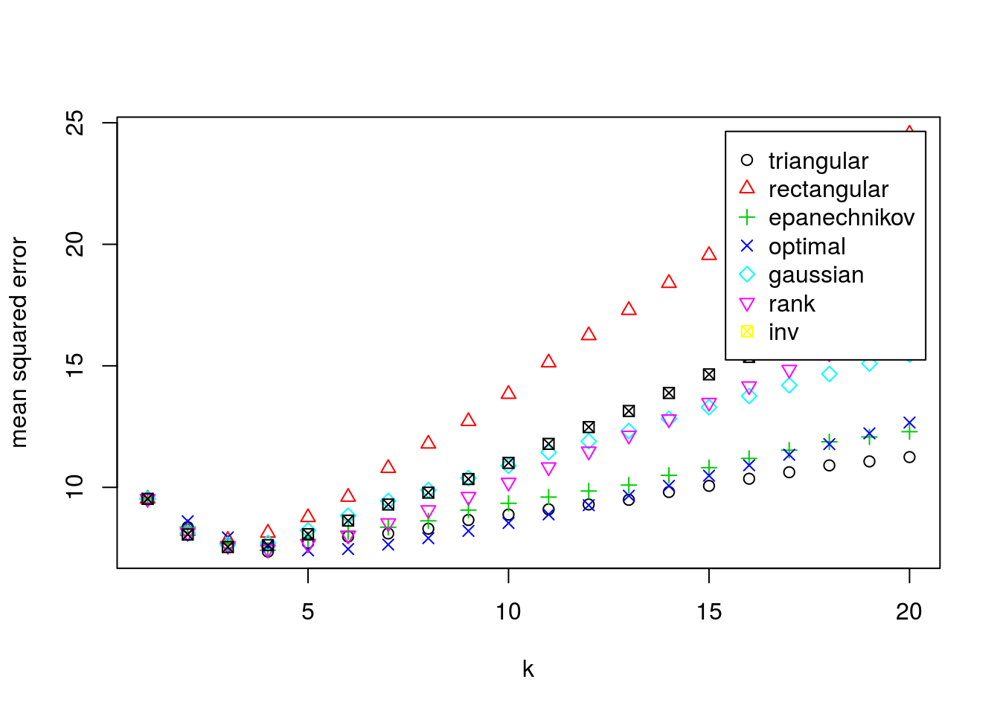

# Problema de regresión

## Conjunto Test y Train

Fijamos una semilla para trabajar.


```r
set.seed(2017)
```

Seleccionamos los datos, los normalizamos, y los guardamos en las variables `df.train` y `df.test`.


```r
library(readr)
library(rknn)
```

```
## Loading required package: gmp
```

```
## 
## Attaching package: 'gmp'
```

```
## The following objects are masked from 'package:base':
## 
##     %*%, apply, crossprod, matrix, tcrossprod
```

```r
df <- read_delim("datawork.csv", ";", escape_double = FALSE, trim_ws = TRUE)
```

```
## Parsed with column specification:
## cols(
##   .default = col_double(),
##   clasobj = col_character(),
##   x30 = col_integer()
## )
```

```
## See spec(...) for full column specifications.
```

```r
n <- dim(df)[1]
val <- sample(1:n, size = round(n/3), replace = FALSE, prob = rep(1/n, n))

df.train <- data.frame(clasobj=df$clasobj[-val], varobj=df$varobj[-val], normalize.unit(df[-val,c(-1,-2)]))
df.test <- data.frame(clasobj=df$clasobj[val], varobj=df$varobj[val], normalize.unit(df[val,c(-1,-2)]))
```

## KNN ponderado con validación cruzada.

Usamos la función `train.kknn` de la librería `kknn`.


```r
library(kknn)
set.seed(2017)
(fit.train2 <- train.kknn(varobj ~ ., df.train[,-1], kmax = 20,
                          kernel = c("triangular", "rectangular", "epanechnikov", "optimal",
                                     "gaussian", "rank","inv"),  
                          distance = 2))
```

```
## 
## Call:
## train.kknn(formula = varobj ~ ., data = df.train[, -1], kmax = 20,     distance = 2, kernel = c("triangular", "rectangular", "epanechnikov",         "optimal", "gaussian", "rank", "inv"))
## 
## Type of response variable: continuous
## minimal mean absolute error: 1.324149
## Minimal mean squared error: 7.355905
## Best kernel: triangular
## Best k: 4
```

Nos dice que el mejor kernel es el optimal con `k` igual a 4.


```r
fit.train2$best.parameters 
```

```
## $kernel
## [1] "triangular"
## 
## $k
## [1] 4
```

```r
fit.train2$response      
```

```
## [1] "continuous"
```

Veamos una representación de los kernels respecto los `k`.


```r
plot(fit.train2)
```



## Clasificiación del conjunto test.

Las predicciones para `df.test` son las siguientes.


```r
(df.pred2 <-predict(fit.train2, df.test[,-2]))
```

```
##    [1]  12.95868  13.95075  24.44228  13.55820  19.99395  26.42297
##    [7]  19.84820  23.99533  12.70577  25.10359  27.73197  12.47743
##   [13]  24.55840  25.09579  12.54290  12.17659  19.99960  13.94365
##   [19]  13.75631  28.62102  19.15621  19.13291  11.62818  24.47522
##   [25]  12.28137  27.77359  19.98536  13.28443  26.29270  12.73455
##   [31]  12.27219  19.60822  26.19051  13.42992  15.50310  14.51701
##   [37]  18.81795  13.36644  27.40199  19.86800  26.93949  13.43375
##   [43]  18.34338  12.35263  12.64626  18.80810  13.49344  24.69147
##   [49]  18.35292  25.01257  19.92874  19.17263  18.85672  14.10685
##   [55]  12.22182  28.02863  19.34148  20.86344  12.11282  29.57682
##   [61]  18.89303  13.60545  12.45152  13.44475  14.34130  18.47374
##   [67]  12.12728  25.17080  13.65448  13.19704  21.08037  26.40875
##   [73]  20.19778  16.11026  29.00693  12.95106  18.83709  12.74949
##   [79]  12.45948  14.68899  19.15517  25.31155  19.16298  15.53237
##   [85]  14.13802  24.38791  23.07306  12.30551  19.35392  17.68801
##   [91]  19.18819  27.42536  24.74343  27.83953  26.06755  13.98634
##   [97]  18.18097  25.28830  27.83942  27.89986  13.51581  19.68976
##  [103]  25.18332  19.37829  14.62106  20.30802  26.44407  25.87553
##  [109]  29.91763  13.70422  19.43146  12.80927  27.04201  12.39866
##  [115]  12.68281  21.40960  27.14651  13.84733 188.25129  19.47923
##  [121]  20.87235  13.20737  19.50777  28.14991  14.44887  24.49607
##  [127]  12.16113  21.12159  14.15930  19.73858  12.54019  20.50540
##  [133]  29.49471  19.33597  28.01125  18.55958  18.68969  14.47748
##  [139]  26.21339  19.60090  26.63275  19.28188  18.33537  24.91897
##  [145]  29.55134  28.49089  22.45711  20.23163  19.38815  26.03660
##  [151]  12.57827  14.15313  12.76657  19.48541  18.76090  12.93874
##  [157]  19.13993  14.36547  12.68433  24.65269  25.81108  12.48307
##  [163]  28.26235  19.24405  11.94631  19.93123  19.90480  12.25224
##  [169]  19.25864  12.85275  20.35023  24.55017  18.77839  27.82862
##  [175]  19.24153  26.70822  12.28742  14.78651  19.90164  21.50748
##  [181]  25.45578  24.79785  18.86534  14.63136  18.37273  28.35157
##  [187]  19.44684  18.80147  15.61852  19.35581  27.18926  25.27517
##  [193]  19.12761  24.94407  19.00787  26.48095  19.68071  18.99075
##  [199]  18.78425  13.35833  13.48777  18.20626  17.93817  12.54259
##  [205]  13.79713  20.49274  20.22467  13.44733  13.65696  20.22794
##  [211]  19.40378  18.75336  12.29155  27.47859  28.28125  15.14233
##  [217]  13.45470  21.74069  21.73124  14.60841  13.36782  21.36177
##  [223]  25.39234  19.37573  12.00379  19.58628  18.89731  30.14034
##  [229]  12.38135  26.84576  19.68072  13.65687  19.28266  13.44194
##  [235]  13.75618  19.52557  19.32337  19.74600  19.85914  11.77911
##  [241]  24.98404  12.81380  18.52173  19.85762  17.66724  13.50312
##  [247]  19.80283  13.31821  18.33998  19.45077  27.37257  19.63090
##  [253]  13.68436  21.30440  15.45801  13.64666  13.20154  26.02067
##  [259]  19.99806  12.32303  13.62333  19.22455  13.56571  20.08373
##  [265]  19.14927  28.66161  19.08957  27.82399  14.21464  25.06105
##  [271]  18.39660  20.66995  18.71491  24.55866  14.11891  13.77256
##  [277]  20.87244  15.91870  18.83370  11.90733  26.84971  20.89672
##  [283]  28.36605  13.62238  18.88136  26.33290  12.24945  21.14056
##  [289]  18.41442  26.46668  13.18005  13.72027  20.22695  13.05951
##  [295]  14.62541  29.24004  12.84865  28.50807  19.11107  27.84530
##  [301]  19.34712  19.28938  15.82449  26.16882  24.29688  18.68133
##  [307]  20.26048  27.33015  18.90064  19.07131  13.96440  12.74758
##  [313]  18.89055  19.48143  18.73773  13.75419  14.90125  25.09205
##  [319]  18.98484  20.48339  15.09432  18.41282  14.24288  12.10842
##  [325]  28.87353  14.56200  18.61210  25.06655  18.65232  27.39461
##  [331]  24.41901  12.31137  24.54633  27.02028  19.62270  19.23419
##  [337]  25.58000  19.57063  13.42529  18.68127  13.70106  12.58730
##  [343]  12.91090  25.26579  17.76248  29.36076  18.38156  15.66279
##  [349]  24.44366  12.60889  13.66955  25.09345  17.80574  24.26216
##  [355]  13.17870  24.95939  26.32406  13.39862  19.71410  24.69473
##  [361]  25.99249  27.93588  13.60761  28.11058  26.11902  18.72344
##  [367]  13.17895  20.14625  20.35184  19.20006  14.90963  27.60137
##  [373]  14.67804  26.19475  24.68536  24.00568  14.50633  12.84645
##  [379]  12.15166  13.78505  19.15348  28.40962  11.89592  18.81271
##  [385]  12.66463  24.99542  14.50867  24.40314  15.39629  12.59200
##  [391]  18.59667  13.91855  19.13104  18.57540  13.81888  31.20190
##  [397]  13.73400  19.43059  14.01003  20.72015  28.12508  13.27863
##  [403]  26.29560  24.63748  18.81379  13.58378  14.43608  14.52599
##  [409]  28.92785  18.03348  18.69518  12.42503  16.83465  27.37223
##  [415]  27.63207  24.96771  20.04903  20.20605  26.89448  25.24033
##  [421]  18.58570  13.62684  13.84895  12.50560  12.01235  24.11872
##  [427]  27.84533  16.28882  11.98276  19.85682  28.81861  19.37395
##  [433]  19.26043  18.54938  18.76161  17.97013  24.62401  20.39926
##  [439]  27.89083  19.41034  14.51035  20.61176  19.59478  19.88999
##  [445]  18.43492  19.27706  18.75383  13.26999  16.69641  13.33763
##  [451]  18.98328  19.05502  24.16121  25.57641  28.54642  20.18345
##  [457]  27.15465  20.12212  18.90748  13.81142  12.62575  13.21932
##  [463]  19.37351  11.78469  18.65273  19.88937  18.73348  15.61413
##  [469]  13.19719  12.90956  24.92265  22.79770  26.00202  19.55156
##  [475]  27.51339  14.01283  19.60592  24.84516  13.65538  20.33254
##  [481]  20.06427  12.97304  19.24067  26.28188  26.03431  13.66150
##  [487]  18.64419  24.69472  11.65021  18.86965  27.10521  26.82936
##  [493]  24.13948  28.85326  22.08785  19.38897  13.33510  18.76994
##  [499]  27.57897  24.48960  14.41934  25.17356  19.07038  20.98361
##  [505]  24.89737  12.90779  22.44572  12.05190  25.02872  18.86518
##  [511]  20.78395  26.07852  24.71546  13.41461  12.77432  17.89496
##  [517]  18.54625  13.21353  12.97034  18.21520  29.63695  28.62158
##  [523]  25.25638  12.53985  26.38132  19.86947  14.23915  12.77329
##  [529]  14.42450  12.43931  19.09276  24.51141  13.15930  22.89303
##  [535]  19.25348  19.27029  13.50055  13.17686  18.46384  19.82231
##  [541]  18.82325  19.08198  24.72867  25.32640  12.86658  18.95179
##  [547]  24.78026  24.80110  18.39548  28.74477  24.02053  25.09035
##  [553]  19.72945  28.66386  26.05413  25.96101  25.19788  19.66965
##  [559]  24.34832  20.28390  18.37351  13.88121  12.69893  13.07583
##  [565]  12.48568  20.24924  22.81733  27.18761  26.33072  24.51599
##  [571]  19.56748  17.66306  18.34028  18.47344  14.19577  24.94508
##  [577]  19.98694  13.76332  18.48833  19.64737  13.12865  18.40581
##  [583]  14.44303  26.96738  29.33692  12.24737  25.22612  18.05707
##  [589]  19.24758  24.66522  22.03206  19.89453  18.98426  19.11983
##  [595]  13.39528  29.48896  17.73000  27.25456  13.30453  12.72086
##  [601]  24.16453  13.03482  19.42262  19.36480  19.19910  12.49422
##  [607]  27.73361  25.60083  19.83186  18.83630  19.61126  19.49165
##  [613]  28.22985  13.15781  24.34673  26.84342  27.95961  27.23365
##  [619]  20.32242  25.59490  13.04587  21.36009  25.84229  19.73984
##  [625]  24.50360  18.69702  27.88229  27.21537  19.51792  13.39682
##  [631]  18.64138  18.68579  18.80090  16.33790  13.77160  24.94611
##  [637]  18.94710  26.56487  18.94784  14.47753  12.93596  14.10525
##  [643]  20.06844  19.33152  26.74629  28.80505  24.70187  12.05374
##  [649]  18.13705  12.09790  21.82489  14.50406  19.29246  12.00649
##  [655]  19.66375  14.22042  25.52160  28.40126  13.51988  18.42022
##  [661]  27.43151  19.87732  12.85358  19.09768  18.99060  11.58634
##  [667]  18.17667  17.63808  15.24301  13.13466  19.41789  19.44926
##  [673]  27.05630  13.83185  19.62082  15.52696  18.48058  12.81189
##  [679]  20.41033  12.48920  24.75022  14.17030  13.44833  20.70559
##  [685]  19.76789  14.15849  24.24127  19.42950  19.98636  19.29341
##  [691]  18.37357  13.06624  18.74194  19.54932  25.05386  12.79938
##  [697]  24.99781  13.30914  13.56557  29.57204  13.03263  27.57370
##  [703]  13.37130  27.59699  13.25927  25.28466  27.82378  12.78483
##  [709]  14.45947  26.97177  14.54146  15.75342  13.21309  19.81744
##  [715]  13.28716  13.41427  18.00241  18.21041  17.86818  15.57407
##  [721]  13.47221  13.99783  13.29176  15.36656  24.35973  19.12727
##  [727]  25.13380  12.92767  18.85555  20.42260  17.75171  27.16605
##  [733]  17.88184  11.93767  27.36922  19.05188  12.48193  19.03800
##  [739]  14.58760  13.19445  27.33007  12.94454  18.84092  12.72167
##  [745]  18.89248  19.56980  12.26555  25.53698  26.03936  27.76591
##  [751]  30.53808  25.22312  18.85226  24.91472  18.38088  18.88106
##  [757]  14.63530  23.65591  14.44767  27.35970  22.95574  12.61526
##  [763]  27.57321  21.45637  13.47521  14.45009  28.12679  13.03374
##  [769]  22.62050  26.01210  13.56525  18.21963  26.85311  24.18166
##  [775]  13.06530  31.15627  23.18161  27.54906  19.21107  12.66508
##  [781]  12.70806  28.83161  17.60817  20.45986  18.83198  15.40326
##  [787]  20.30257  13.60017  13.05965  19.18726  26.19078  19.19408
##  [793]  18.63569  12.39753  19.32122  13.07727  13.59720  18.82804
##  [799]  19.74602  12.63290  19.33324  18.23921  14.76749  28.17941
##  [805]  26.65572  24.56355  14.77852  26.66277  12.43262  12.61274
##  [811]  13.07731  18.44538  23.32861  19.43559  18.96387  14.93903
##  [817]  13.36135  23.75293  12.66263  18.14971  21.02375  19.37996
##  [823]  17.94870  12.62645  18.81337  26.00288  13.82808  20.42491
##  [829]  13.34492  27.77394  29.11936  27.31738  12.45234  22.97785
##  [835]  19.90437  13.44387  18.97956  15.02270  13.16754  13.13148
##  [841]  19.75501  26.23155  27.80051  19.61505  11.97870  14.35186
##  [847]  13.66292  12.66607  19.49803  28.88528  23.59505  18.18736
##  [853]  14.21395  27.65038  18.62762  25.24081  26.05052  29.18092
##  [859]  24.77186  18.93598  26.91140  12.42060  18.28179  18.18915
##  [865]  24.95324  28.46777  26.52586  13.60201  18.86608  22.78951
##  [871]  19.72459  25.19810  18.27619  12.12710  12.01215  19.68041
##  [877]  29.68352  28.95005  28.39634  27.66868  26.19992  24.92385
##  [883]  13.74955  19.44640  11.94633  24.49176  27.06015  19.38043
##  [889]  18.28664  17.01976  24.90453  19.45021  13.57971  13.94427
##  [895]  29.08784  12.36482  19.47231  13.60800  13.34885  13.50336
##  [901]  25.94438  12.83898  20.56089  13.42471  12.87278  13.70490
##  [907]  13.47600  26.10226  18.08770  28.77295  19.14993  19.75503
##  [913]  26.71347  20.01361  13.16385  29.45720  12.47370  16.13161
##  [919]  13.21830  19.72536  25.58185  18.60175  20.03766  19.89344
##  [925]  26.36858  25.11871  12.55645  12.45402  24.49824  26.34242
##  [931]  24.26019  24.39442  12.25923  14.23296  21.15910  13.35620
##  [937]  13.20523  18.61569  26.22453  12.03592  18.11004  25.48339
##  [943]  25.63637  27.20114  18.50617  14.64952  19.46173  27.76237
##  [949]  19.09776  18.73025  20.94112  19.84843  12.97150  19.47479
##  [955]  25.40825  20.63591  19.69200  19.46672  25.14699  13.63360
##  [961]  13.87729  20.04678  13.87729  24.57208  11.87068  18.67981
##  [967]  20.81677  19.84043  19.73464  11.81690  12.65524  16.69717
##  [973]  12.48837  13.53983  15.88893  25.90177  18.19387  24.40036
##  [979]  28.62997  13.52849  12.37246  12.06637  19.59954  12.97127
##  [985]  22.05436  25.84111  24.99485  24.42953  18.86066  20.07978
##  [991]  20.77100  19.02986  24.76361  18.04300  14.47892  19.77538
##  [997]  19.20493  12.68690  12.82234  28.85167  14.13300  19.85455
## [1003]  24.94480  18.24526  24.67258  18.55038  27.25587  13.74290
## [1009]  19.42868  24.18232  19.11133  20.31678  19.85725  13.56933
## [1015]  28.06395  12.64045  19.78996  18.84176  29.59690  13.96346
## [1021]  21.64703  19.35603  17.92723  19.40595  17.71319  26.25452
## [1027]  12.26923  15.20716  29.13133  27.83223  27.68526  12.32366
## [1033]  13.30240  21.57541  24.93123  12.56446  17.96229  24.80380
## [1039]  26.19603  28.29383  12.33654  18.95853  27.55726  19.51809
## [1045]  12.72627  19.56788  12.46012  24.73588  12.70006  24.82420
## [1051]  11.91556  23.87397  12.43195  26.15679  14.20437  12.53208
## [1057]  26.26998  12.81262  13.87644  20.02940  14.43808  27.38297
## [1063]  12.32414  12.76907  18.83200  19.20052  24.15995  24.23495
## [1069]  19.14530  18.70632  13.87652  24.71322  12.21241  28.93334
## [1075]  27.82898  13.30721  23.37365  25.74887  18.67242  27.60728
## [1081]  19.37489  13.16426  19.89527  18.90327  20.03618  13.61966
## [1087]  18.07568  30.15118  18.98697  26.09280  18.81167  24.49470
## [1093]  26.18304  27.00210  29.45459  26.88723  24.81358  24.48718
## [1099]  13.40410  19.96521  30.46970  18.70910  19.00536  27.03556
## [1105]  28.52199  12.88719  27.44922  26.65184  11.98213  18.53134
## [1111]  19.54306  28.32993  18.16873  19.27476  12.43148  12.73743
## [1117]  17.77366  26.88615  19.32961  12.43995  25.02899  12.24545
## [1123]  19.29298  27.28731  28.99582  24.16025  15.16350  26.02823
## [1129]  25.88385  18.57577  25.15089  20.34702  27.91387  19.20286
## [1135]  13.78628  13.31487  15.07520  18.73451  12.71744  26.55273
## [1141]  19.45003  18.86990  20.21959  14.06989  19.39218  24.60471
## [1147]  15.47359  13.39962  19.73733  26.13599  27.16016  27.56668
## [1153]  23.09421  23.87857  24.67699  12.88412  18.39999  14.28112
## [1159]  24.50556  12.93968  27.17044  21.09575  26.76374  19.53005
## [1165]  12.18153  14.87549  13.73282  12.77984  24.93930  24.22228
## [1171]  24.75855  19.79336  25.40181  24.38111  14.44744  27.19688
## [1177]  12.12542  26.93373  17.98742  29.34160  12.98710  20.67815
## [1183]  13.18410  12.74623  26.28503  13.41908  28.79212  18.86915
## [1189]  27.04946  20.64460  13.50902  29.32863  19.22837  15.13651
## [1195]  21.13041  18.44973  14.25398  12.52425  19.24817  18.11560
## [1201]  24.64613  12.54246  12.48741  21.42363  14.85204  29.04388
## [1207]  14.15624  19.20916  12.21108  12.62115  12.02026  29.17642
## [1213]  12.37204  27.67113  24.84509  25.10453  13.70010  18.97566
## [1219]  12.55745  19.15159  28.22786  18.48273  20.04034  25.94062
## [1225]  18.73117  12.07726  13.48232  20.82653  27.20068  16.12702
## [1231]  19.37607  18.77154  12.64200  23.91227  12.65541  27.53667
## [1237]  29.94262  21.27878  18.86552  13.69551  13.76244  18.97570
## [1243]  27.68051  25.69273  18.42594  28.88497  26.88542  18.66678
## [1249]  24.83507  27.91634  12.41522  26.83356  28.85981  18.77870
## [1255]  19.66188  19.44291  19.18297  19.38668  28.62267  19.29283
## [1261]  12.95106  26.72477  29.45346  26.25689  19.22594  27.65027
## [1267]  13.12484  14.06423  27.76297  12.16569  18.78861  28.84031
## [1273]  19.41673  12.69410  23.72936  19.41816  28.91673  27.78152
## [1279]  18.61593  24.60343  26.04138  19.54304  18.73061  29.31566
## [1285]  24.03352  18.75692  28.45191  15.20727  20.09217  13.30847
## [1291]  26.19000  26.47320  12.45407  19.56132  12.77758  20.44060
## [1297]  12.73428  12.43681  25.07618  26.08877  20.14714  20.69256
## [1303]  28.25613  12.98901  24.35485  18.42470  16.26899  18.26388
## [1309]  27.05893  19.86982  19.08220  20.52390  19.32340  13.32630
## [1315]  18.94521  25.02640  18.75580  20.14197  12.13113  13.86772
## [1321]  15.86138  18.53696  27.41084  13.16137  24.79052  26.21349
## [1327]  24.20007  28.54248  24.53781  12.41142  18.98228  22.69294
## [1333]  27.28046
```

El error cuadrático medio para el caso óptimo es,


```r
library(zoo)
```

```
## 
## Attaching package: 'zoo'
```

```
## The following objects are masked from 'package:base':
## 
##     as.Date, as.Date.numeric
```

```r
library(hydroGOF)
rmse(df.pred2, df.test$varobj)
```

```
## [1] 14.95591
```

## KNN aleatorio

Primero vamos a calcular el número de clasificadores óptimo.


```r
(p=ncol(df.train)-2)
```

```
## [1] 40
```

```r
m=20 #Tomamos 20 variables
(rnc=r(p,m,eta=0.9,method="poisson"))
```

```
## [1] 9
```

Aplicamos la técnica KNN aleatorio con r = 5


```r
fit.train3 = rknn(data=df.train[,-1], newdata= df.test[,-1],y=df.train$varobj, k = 4, r=5, mtry = m)
```

Veamos las características de este KNN aleatorio,


```r
(df.pred3 = as.numeric(paste(fit.train3$pred)))
```

```
##    [1]  12.50  12.30  24.48  13.18  19.12  26.17  19.91  17.66  11.88
##   [10]  23.89  26.19  10.98  23.46  24.41  12.05  12.30  20.40  13.40
##   [19]  13.46  26.81  19.21  18.11  12.11  24.84  11.58  26.82  17.66
##   [28]  11.83  25.36  13.05  11.22  19.99  24.41  12.30  13.18  12.96
##   [37]  18.11  14.75  27.74  19.99  25.45  12.13  18.14  12.18  13.00
##   [46]  18.30  12.64  24.48  18.30  15.04  18.58  18.69  18.62  11.92
##   [55]  12.05  27.37  18.80  24.52  11.70  29.52  18.66  12.03  12.84
##   [64]  11.69  12.37  17.54  12.13  24.84  12.05  13.00  19.65  26.17
##   [73]  20.89  13.12  28.19  12.13  19.49  12.41  12.34  14.21  19.19
##   [82]  24.46  18.66  15.82  12.58  12.11  17.54  12.04  20.89  17.76
##   [91]  19.15  26.17  24.61  26.29  24.81  14.16  13.37  24.39  26.89
##  [100]  25.94  13.54  19.32  14.78  18.56  12.88  19.75  26.45  14.78
##  [109]  30.43  12.21  18.55  12.79  28.19  12.30  12.70  24.13  26.68
##  [118]  12.03 136.25  18.55  24.59  13.58  18.17  26.22  15.51  24.80
##  [127]  12.73  24.45  14.16  19.99  12.64  18.72  28.18  18.02  26.67
##  [136]  17.66  19.10  12.03  25.24  19.99  31.81  19.44  18.35  15.04
##  [145]  26.98  25.94  18.22  19.25  18.42  26.81  12.30  12.43  12.92
##  [154]  18.11  18.54  14.88  17.24  13.38  12.18  23.89  25.54  14.75
##  [163]  27.74  19.10  12.03  18.17  18.50  11.71  17.35  12.30  19.19
##  [172]  25.01  17.72  26.59  19.32  25.24  12.38  13.10  19.91  18.96
##  [181]  24.83  25.51  19.25  12.17  17.50  27.96  20.20  18.55  13.48
##  [190]  18.54  24.33  24.52  18.62  24.54  18.34  25.24  21.09  19.81
##  [199]  17.21  12.18  12.92  17.80  10.98  12.18  12.93  17.92  17.76
##  [208]  12.03  12.13  17.94  17.76  18.19  12.03  26.17  26.83  13.18
##  [217]  12.03  17.66  24.66  13.89  12.05  18.65  24.41  17.81  11.58
##  [226]  17.80  18.83  27.53  12.03  26.68  17.86  12.20  17.90  13.46
##  [235]  12.30  18.66  18.62  18.95  18.43  11.15  24.65  12.03  17.54
##  [244]  18.11  17.44  11.58  18.62  14.18  17.81  18.66  28.62  17.80
##  [253]  12.30  17.54  12.30  12.08  12.30  24.88  20.89  11.45  13.07
##  [262]  18.54  12.30  18.66  19.19  28.43  18.64  26.89  13.00  14.51
##  [271]  18.52  19.14  17.80  24.47  12.76  13.46  13.64  13.78  17.72
##  [280]  11.22  26.89  18.55  27.30  13.00  18.54  24.86  12.03  24.47
##  [289]  18.20  28.08  12.79  12.18  18.86  12.20  12.34  25.28  12.13
##  [298]  27.74  18.38  26.82  17.54  19.28  13.10  23.46  24.09  18.25
##  [307]  18.12  27.77  18.35  18.62  12.05  12.03  17.98  18.11  17.44
##  [316]  11.53  12.98  23.68  17.91  18.95  16.05  18.20  15.51  15.01
##  [325]  27.87  14.34  18.25  24.41  19.01  27.74  25.33  12.18  24.09
##  [334]  25.65  17.46  18.19  24.46  18.16  12.58  17.76  12.20  11.85
##  [343]  12.53  24.37  17.66  26.17  18.43  13.89  25.01  12.61  12.16
##  [352]  24.41  12.93  23.62  11.58  14.78  26.22  12.59  19.13  23.90
##  [361]  25.63  29.03  12.41  27.98  25.65  18.35  12.08  18.54  24.77
##  [370]  17.54  12.30  24.37  13.46  24.37  23.85  14.51  12.43  12.37
##  [379]  12.18  13.00  18.20  26.82  12.03  19.10  12.18  24.60  12.05
##  [388]  23.80  13.46  13.46  17.46  12.53  18.34  20.89  12.18  29.50
##  [397]  12.75  17.81  12.70  18.59  27.14  12.20  26.89  24.17  17.44
##  [406]  13.05  12.50  13.46  30.43  17.54  18.30  12.30  13.46  26.98
##  [415]  24.93  21.22  18.54  19.38  25.28  24.84  18.55  12.01  14.16
##  [424]  12.13  12.70  23.62  27.11  12.96  12.37  17.80  29.52  19.44
##  [433]  17.35  18.44  18.30  17.90  24.59  18.94  26.89  17.35  12.30
##  [442]  18.43  19.01  17.76  17.98  20.97  18.14  11.85  12.39  11.80
##  [451]  17.44  17.86  23.62  24.50  26.52  18.88  26.81  18.56  17.46
##  [460]  13.05  11.84  12.64  19.49  11.82  17.44  18.49  19.33  13.46
##  [469]  11.22  12.65  25.50  23.46  24.52  18.77  28.03  12.08  17.66
##  [478]  24.65  13.00  18.17  18.66  11.69  18.54  23.68  25.63  11.89
##  [487]  18.55  24.21  11.06  17.98  26.04  26.17  25.28  26.16  24.17
##  [496]  19.55  15.92  17.66  26.81  25.72  12.30  24.09  19.10  19.53
##  [505]  24.96  16.61  24.17  11.58  26.26  17.91  20.97  25.45  24.09
##  [514]  12.30  11.71  17.66  18.17  13.18  11.91  18.00  27.28  25.82
##  [523]  25.28  13.45  25.36  18.42  12.30  12.61  12.13  13.18  18.56
##  [532]  24.11  12.08  14.78  18.54  18.56  12.21  12.08  17.50  18.35
##  [541]  18.19  18.20  23.03  24.45  13.18  19.59  14.78  23.46  17.81
##  [550]  29.50  24.13  24.21  18.43  26.98  24.75  25.63  14.43  17.70
##  [559]  24.41  18.66  18.02  12.18  12.30  12.60  11.78  19.49  24.21
##  [568]  27.98  24.81  24.44  18.83  17.66  17.80  18.66  13.36  13.64
##  [577]  19.01  12.16  17.21  19.38  12.75  17.35  14.21  26.71  26.81
##  [586]  12.13  24.17  17.41  17.35  19.13  25.29  18.08  18.02  19.12
##  [595]  12.96  27.94  17.66  26.89  14.18  13.12  14.51  12.30  19.04
##  [604]  19.55  18.38  12.30  26.81  19.41  18.93  18.54  23.96  19.32
##  [613]  27.87  11.82  22.31  26.45  28.07  26.43  19.55  24.21  11.22
##  [622]  18.21  26.47  19.38  17.76  23.52  26.72  27.74  20.24  12.97
##  [631]  19.15  17.54  18.77  13.78  12.18  25.55  19.19  25.54  18.95
##  [640]  13.78  12.13  14.45  17.54  18.86  26.22  27.96  23.96  11.22
##  [649]  17.72  11.22  15.01  13.10  18.16  12.03  17.76  12.96  24.06
##  [658]  28.18  12.38  17.50  26.81  17.66  11.82  18.14  18.55  11.69
##  [667]  17.81  17.80  12.53  12.61  17.76  19.64  26.88  13.56  23.88
##  [676]  14.77  18.20  11.22  11.09  12.05  24.61  12.13  11.83  19.01
##  [685]  18.54  12.90  24.09  18.65  18.54  19.26  17.54  13.46  18.40
##  [694]  18.52  25.12  12.07  13.64  12.45  11.80  26.89  11.80  26.82
##  [703]  12.03  27.74  11.93  24.59  28.17  11.82  11.91  25.94  13.00
##  [712]  13.37  11.93  19.91  12.79  12.56  17.81  18.16  17.44  16.29
##  [721]  13.18  11.71  12.03  12.49  23.90  18.44  24.47  12.30  17.35
##  [730]  19.99  17.76  25.24  17.80  11.58  24.05  18.86  11.88  19.28
##  [739]  13.10  15.51  29.03  12.20  17.44  13.36  18.91  18.40  11.80
##  [748]  23.46  24.05  26.22  27.96  24.44  18.99  25.79  18.30  18.43
##  [757]  14.68  14.78  13.36  38.48  18.59  12.00  26.05  17.50  12.18
##  [766]  12.34  26.81  12.03  23.46  25.28  12.97  18.15  17.76  14.78
##  [775]  12.43  27.42  18.69  25.94  17.76  12.30  11.22  26.89  17.41
##  [784]  19.99  18.35  13.10  20.89  12.38  12.67  18.20  24.70  19.19
##  [793]  18.00  11.15  19.15  12.18  12.30  18.66  19.26  11.82  18.66
##  [802]  17.55  13.14  27.96  26.17  24.59  11.22  26.05  12.01  12.05
##  [811]  13.46  18.56  14.78  18.23  18.25  12.43  12.59  25.44  12.39
##  [820]  17.50  14.79  18.83  17.54  13.46  18.02  25.54  13.31  17.54
##  [829]  12.35  27.53  29.03  26.89  12.30  24.65  19.25  13.37  18.82
##  [838]  14.60  12.20  12.20  19.14  26.17  25.96  19.54  11.82  14.23
##  [847]  13.40  12.30  20.00  27.96  17.54  18.65  12.67  27.74  18.50
##  [856]  25.23  26.72  28.34  24.16  18.54  26.17  12.48  17.80  17.76
##  [865]  24.52  30.43  25.45  13.46  18.54  25.05  19.19  25.18  17.80
##  [874]  12.05  11.82  17.44  27.34  25.65  27.85  27.34  25.24  15.01
##  [883]  13.18  19.44  11.77  14.43  26.22  19.18  18.19  14.78  25.01
##  [892]  19.67  12.30  14.75  27.74  11.84  19.53  13.70  12.30  12.55
##  [901]  23.62  12.18  19.25  11.22  12.37  12.01  13.46  25.45  17.66
##  [910]  30.04  18.83  18.95  25.89  18.16  13.18  26.59  11.77  11.99
##  [919]  12.08  18.86  14.43  17.81  18.83  19.91  28.03  25.33  12.18
##  [928]  14.52  25.40  26.59  23.62  23.87  11.82  13.36  19.09  12.50
##  [937]  11.63  19.73  24.86  11.58  17.80  24.92  24.41  25.65  18.55
##  [946]  13.15  17.90  25.28  17.91  17.54  19.65  18.83  13.05  18.34
##  [955]  24.60  18.49  17.35  18.21  23.85  11.58  12.62  18.32  13.26
##  [964]  23.62  11.15  18.32  17.98  17.76  19.32  11.64  11.85  13.62
##  [973]  11.58  11.82  13.42  24.41  17.55  24.11  27.74  13.11  12.37
##  [982]  12.56  18.61  12.90  14.51  25.65  25.01  25.01  17.98  17.76
##  [991]  17.42  18.11  22.51  17.66  11.82  19.28  20.36  12.37  11.75
## [1000]  26.59  13.99  19.15  14.79  19.29  18.54  18.05  27.80  13.17
## [1009]  19.31  23.87  19.19  18.50  19.38  13.18  28.35  12.23  19.40
## [1018]  17.41  26.89  12.70  18.66  19.28  17.46  19.12  17.44  26.17
## [1027]  12.37  17.29  30.83  26.39  25.81  12.54  13.10  17.80  24.92
## [1036]  12.03  17.33  25.15  27.01  27.87  11.58  18.66  24.92  18.53
## [1045]  12.45  17.74  13.05  23.96  11.52  24.47  12.13  24.21  12.30
## [1054]  25.63  12.13  11.93  26.88  12.13  12.03  18.62  11.98  27.74
## [1063]  12.03  12.05  18.54  18.38  24.21  24.77  20.40  18.35  11.93
## [1072]  23.99  12.03  26.67  27.62  13.46  24.13  24.41  18.44  24.45
## [1081]  18.60  12.30  17.66  18.52  19.10  12.30  18.20  27.28  17.50
## [1090]  23.89  17.76  24.13  25.76  25.76  27.96  24.86  24.52  24.21
## [1099]  12.88  21.28  26.81  17.66  17.70  26.89  27.28  12.90  24.52
## [1108]  25.28  11.83  18.87  17.54  27.35  17.78  18.86  11.83  12.13
## [1117]  17.54  15.01  19.31  12.07  24.45  12.20  19.51  26.81  27.94
## [1126]  23.62  12.13  28.01  25.45  18.43  23.62  18.62  25.99  18.18
## [1135]  12.37  12.60  13.42  18.02  12.81  25.94  18.66  18.10  18.08
## [1144]  12.67  20.09  24.47  12.50  12.93  20.40  25.94  25.76  24.06
## [1153]  14.78  26.26  24.09  13.58  18.70  13.38  23.62  14.06  27.61
## [1162]  19.14  26.17  18.07  11.66  12.30  14.06  12.96  24.61  23.46
## [1171]  15.04  18.54  24.71  24.52  13.96  25.94  12.03  27.28  18.30
## [1180]  29.57  11.82  18.96  12.30  12.05  26.52  12.03  27.74  18.62
## [1189]  25.94  19.15  12.18  27.66  17.98  15.99  24.47  18.64  14.68
## [1198]  11.82  18.11  18.66  24.17  12.53  13.18  19.19  11.22  26.22
## [1207]  12.64  17.77  11.99  12.07  11.22  26.06  11.22  25.45  24.92
## [1216]  24.17  13.70  25.05  12.12  18.21  17.39  17.35  19.42  24.50
## [1225]  18.94  12.90  13.48  24.71  26.22  13.46  19.15  17.50  13.18
## [1234]  23.62  11.80  27.61  27.14  18.22  18.16  12.03  13.61  18.11
## [1243]  25.54  24.77  18.81  29.50  25.54  17.80  17.21  26.59  11.66
## [1252]  28.11  27.35  18.02  18.62  18.89  17.91  18.72  25.54  18.50
## [1261]  14.16  26.22  28.52  27.43  19.38  25.76  12.18  14.16  28.24
## [1270]  12.54  17.81  25.94  19.32  12.57  23.76  17.86  26.88  25.54
## [1279]  18.30  23.88  25.65  18.94  18.29  25.24  24.88  18.54  28.11
## [1288]  12.15  17.76  12.56  20.06  26.89  11.22  18.30  12.30  17.46
## [1297]  12.70  12.37  24.52  24.84  19.91  21.70  28.34  13.46  26.29
## [1306]  19.35  12.79  17.66  28.11  19.53  19.15  27.17  19.28  13.05
## [1315]  17.81  24.06  18.28  18.11  12.05  12.30  12.93  19.14  26.59
## [1324]  12.52  24.92  25.65  23.62  28.19  23.46  12.05  18.21  18.69
## [1333]  24.86
```

Calculamos el error cuadrático medio para esta predicción,


```r
library(zoo)
library(hydroGOF)
rmse(df.pred3, df.test$varobj)
```

```
## [1] 16.47495
```

El valor del error cuadrático medio usando el método anterior era,


```r
rmse(df.pred2, df.test$varobj)
```

```
## [1] 14.95591
```

Concluimos que el modelo basado en un KNN ponderado es mejor que el aleatorio, al menos para la semilla que consideramos al comienzo. Sin embargo el aleatorio se ejecuta mucho mas rápido que el poderado. Podriamos pensar si este tiempo de ejecución adiccional merece la pena comparando los errores resultantes.

